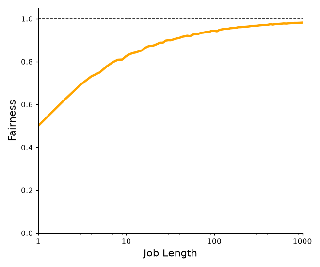

# Chapter 8

1. Run a few randomly-generated problems with just two jobs and two queues; compute the MLFQ execution trace for each. Make your life easier by limiting the length of each job and turning off I/Os.

For answer one I wrote the following script

```bash
for i in {1..3}; do
./mlfq.py -j 2 -n 2 -m 20 -M 0 -s $i -c;
done
```

2. How would you run the scheduler to reproduce each of the examples in the chapter?

To make the scheduler reproduce each example we could use the `-l` to recreate the jobs and `-i` to ensure we use the same IO time & activate `-S` so we stay at the same priority level after a job:

```bash
./mlfq.py -n 3 -q 10 -l 0,200,0 -c # Figure 8.2
./mlfq.py -n 3 -q 10 -l 0,200,0:100,20,0 -c # Figure 8.3
./mlfq.py -n 3 -q 10 -i 9 -l 0,200,0:0,20,1 -c # Figure 8.4
./mlfq.py -n 3 -q 10 -i 1 -l 0,120,0:100,50,1:100,50,1 -B 50 -c # Figure 8.5
./mlfq.py -n 3 -q 10 -i 9 -S -l 0,200,0:0,200,9 -c # Figure 8.6
```

3. How would you configure the scheduler parameters to behave just
like a round-robin scheduler?

If we restrict to a single queue we know that mlfq will use round robin as the default behavior since every job is of the same level. Would look like this:

```bash
./mlfq.py -n 1 -q 10 -j 3 -m 50 -M 0 -c
```

4. Craft a workload with two jobs and scheduler parameters so that
one job takes advantage of the older Rules 4a and 4b (turned on
with the -S flag) to game the scheduler and obtain 99% of the CPU
over a particular time interval.

With the old rules active  `-S` we can cheat the system by using as much IO as possible without using the entire quantam. We could set it up using these args:

```bash
./mlfq.py -n 1 -q 10 -j 3 -m 50 -M 0 -c
```

5. Given a system with a quantum length of 10 ms in its highest queue,
how often would you have to boost jobs back to the highest priority
level (with the -B flag) in order to guarantee that a single long-
running (and potentially-starving) job gets at least 5% of the CPU?

When a job gets boosted to the highest queue it gets to run for a whole quantam. We can use divide quantam by the boost interval to get 10 / .05 = 200 ms. So `-B` should be set to 200ms to guarantee 5% the of the CPU for a starved job.

6. One question that arises in scheduling is which end of a queue to
add a job that just finished I/O; the -I flag changes this behavior
for this scheduling simulator. Play around with some workloads
and see if you can see the effect of this flag

When the `-I` flag was in use I noticed that jobs returning from IO get put into the front of the queue as soon as they are done. Without the flag it is the opposite, they end up waiting for all other jobs before their turn.

We can demonstrate with a simple example.

```bash
./mlfq.py -n 1 -q 10 -i 5 -l 0,50,5:0,50,5 -c
```

I won't put the output here because it is long, but I observed this seemed fair. When job 0 finishes IO it goes to the back of the queue and lets job 1 run.

Then with the flag

```bash
./mlfq.py -n 1 -q 10 -i 5 -l 0,50,5:0,50,5 -I -c
```

In this example the opposite happened. Job 0 goes straight to the front which is less fair than the first example. This rule favors jobs that end IO over those who are waiting in the queue.

# Chapter 9

1. Compute the solutions for simulations with 3 jobs and random seeds of 1, 2, and 3.

I ran the following to compute all the winning tickets for 1-3. To compute this the simulation does `random_num % num_tickets_left` to get the winning ticket. For example in in one we have the following jobs

```
Job 0 ( length = 1, tickets = 84 )
Job 1 ( length = 7, tickets = 25 )
Job 2 ( length = 4, tickets = 44 )
```
```
```


So for the first winner we do `651593 % 153` to get 119 as the first winner. 119 falls in the interval of Job 2 (109 - 153) so job 2 gets run first. Next remainder we get is 9 which falls in interval 0 (0  - 14) so job 0 runs. Quantum is 1 so it has length 3 left now. We repeat this process. As jobs lengths go down to zero their tickets are removed from the pool since they don't need to run anymore until all jobs are length 0 (done).

```bash
for i in {1..3}; do echo "<----->"; ./lottery.py -s $i -c ; done | grep -E "Winning|<----->"
Random 651593 -> Winning ticket 119 (of 153) -> Run 2
Random 788724 -> Winning ticket 9 (of 153) -> Run 0
Random 93859 -> Winning ticket 19 (of 69) -> Run 1
Random 28347 -> Winning ticket 57 (of 69) -> Run 2
Random 835765 -> Winning ticket 37 (of 69) -> Run 2
Random 432767 -> Winning ticket 68 (of 69) -> Run 2
Random 762280 -> Winning ticket 5 (of 25) -> Run 1
Random 2106 -> Winning ticket 6 (of 25) -> Run 1
Random 445387 -> Winning ticket 12 (of 25) -> Run 1
Random 721540 -> Winning ticket 15 (of 25) -> Run 1
Random 228762 -> Winning ticket 12 (of 25) -> Run 1
Random 945271 -> Winning ticket 21 (of 25) -> Run 1
Random 605944 -> Winning ticket 169 (of 197) -> Run 2
Random 606802 -> Winning ticket 42 (of 197) -> Run 0
Random 581204 -> Winning ticket 54 (of 197) -> Run 0
Random 158383 -> Winning ticket 192 (of 197) -> Run 2
Random 430670 -> Winning ticket 28 (of 197) -> Run 0
Random 393532 -> Winning ticket 123 (of 197) -> Run 1
Random 723012 -> Winning ticket 22 (of 197) -> Run 0
Random 994820 -> Winning ticket 167 (of 197) -> Run 2
Random 949396 -> Winning ticket 53 (of 197) -> Run 0
Random 544177 -> Winning ticket 63 (of 197) -> Run 0
Random 444854 -> Winning ticket 28 (of 197) -> Run 0
Random 268241 -> Winning ticket 124 (of 197) -> Run 1
Random 35924 -> Winning ticket 70 (of 197) -> Run 0
Random 27444 -> Winning ticket 61 (of 197) -> Run 0
Random 464894 -> Winning ticket 55 (of 103) -> Run 1
Random 318465 -> Winning ticket 92 (of 103) -> Run 2
Random 380015 -> Winning ticket 48 (of 103) -> Run 1
Random 891790 -> Winning ticket 16 (of 103) -> Run 1
Random 525753 -> Winning ticket 41 (of 103) -> Run 1
Random 560510 -> Winning ticket 87 (of 103) -> Run 2
Random 236123 -> Winning ticket 47 (of 103) -> Run 1
Random 23858 -> Winning ticket 65 (of 103) -> Run 1
Random 325143 -> Winning ticket 3 (of 30) -> Run 2
Random 13168 -> Winning ticket 88 (of 120) -> Run 1
Random 837469 -> Winning ticket 109 (of 120) -> Run 1
Random 259354 -> Winning ticket 34 (of 120) -> Run 0
Random 234331 -> Winning ticket 91 (of 120) -> Run 1
Random 995645 -> Winning ticket 5 (of 60) -> Run 0
Random 470263 -> Winning ticket 1 (of 6) -> Run 2
Random 836462 -> Winning ticket 2 (of 6) -> Run 2
Random 476353 -> Winning ticket 1 (of 6) -> Run 2
Random 639068 -> Winning ticket 2 (of 6) -> Run 2
Random 150616 -> Winning ticket 4 (of 6) -> Run 2
Random 634861 -> Winning ticket 1 (of 6) -> Run 2
```


2. Now run with two specific jobs: each of length 10, but one (job 0) with 1 ticket and the other (job 1) with 100 (e.g., -l 10:1,10:100). What happens when the number of tickets is so imbalanced? Will job 0 ever run before job 1 completes? How often? In general, what does such a ticket imbalance do to the behavior of lottery scheduling?

I ran this a few times and could not get job 0 to go first. It is definitely possible and I could have kept going until it did, we know there is around a 1% chance of job one getting to go each quantum, so with the job length 10 this is possible but very very unlikely. Ticket balances like this make the lottery system very unfair to jobs that do not have very many tickets.

3. When running with two jobs of length 100 and equal ticket allocations of 100 (-l 100:100,100:100), how unfair is the scheduler? Run with some different random seeds to determine the (probabilistic) answer; let unfairness be determined by how much earlier one
job finishes than the other.

When running a few times here are my results. I measuered a few different fist and second job finish times with a difference of 8, 4, 14, 15. My conclusion is this isn't very fair, they should be getting close to equal turns but they are not. This is probably because 100 isn't really a big enough sample size for the results to converge with the probability p .5.

4. How does your answer to the previous question change as the quantum size (-q) gets larger?

As we get larger `-q` it also gets a lot less fair. If I do something extreme such as q = 50 for two jobs with length 100 I get a very bad fairness score. Larger units allow luck to be a more dominant force. With two jobs if we had a quantum of both jobs length it is a 50/50 which job will run.

5. Can you make a version of the graph that is found in the chapter? What else would be worth exploring? How would the graph look with a stride scheduler?

We can simulate very simple math. We can see that as the job length increases the fairness score goes up just like in the textbook:


.
